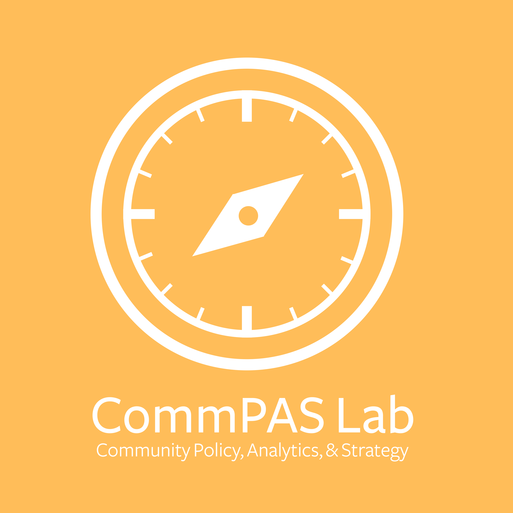

<link rel="stylesheet" href="styles.css" type="text/css">

# Equity Indicator Reports

The following reports present equity indicator, inspired by efforts like that of [St. Louis Equity Indicators Project](https://www.stlouis-mo.gov/government/departments/mayor/initiatives/resilience/equity/index.cfm) emphasizing racial or ethnic disparities in measures of community well-being. The goal is to make indicators from sources like the U.S. Census American Community Survey readily accessible and reproducible by others.[^1] Indicators derived from sampled data, like the American Community Survey are measured with uncertainty and we aim to make that uncertainy apparent.

The initial reports focus on child poverty and educational attainment (though more are in progress) for several localiities in the Charlottesville area (though more are in progress). Each contains three sections:

* Regional summaries, providing an explanation of the indicator, a summary table showing outcomes for selected population groups in the region along with disparity ratios, and details about the data source;
* Maps by census tract, mapping the indicator for each selected population, to help reveal variations within the locality;
* Population and rate tables, showing the population counts and indicator for each selected population group by tract along witn the margins of error to make plain the uncertainty around som

# Racial Disparity in Historical Context

*DRAFT*

Stemming from the historical legacies of slavery, signficiant inequality between whites and blacks persist. As the epicenter for [the slave trade](https://www.smithsonianmag.com/history/maps-reveal-slavery-expanded-across-united-states-180951452/) in the United States, Virginia sees widespread racial gaps in almost every measure of [wealth](http://www.equality-of-opportunity.org/neighborhoods/), [health](https://vizhub.healthdata.org/subnational/usa), and [wellbeing](https://projects.fivethirtyeight.com/mortality-rates-united-states/inter-violence/#2014).[^2] Looking more closely at the region surrounding Charlottesville, by 1860 the population of enslaved blacks exceeded the population of whites in Albemarle County, Orange County, Louisa County, Fluvanna County, and Buckingham County (1860 Census), and were at near parity in Nelson County. Beyond slavery, the Greater Charlottesville community witnessed lynchings, exclusionary zoning in home ownership, the destruction of black communities, racial segregation, and “massive resistance” to the court ordered end to segregation. (links tba)

While much of the region had majority enslaved populations just before the Civil War, whites outnumbered blacks 2:1 in Albemarle County and Nelson County by 1910. Black populations shrank through the combination of migration for the promise of better jobs and better treatment and continued racial discrimination in housing, education, and work. The crush of enslavement, violence, and political neglect is evident in the ongoing inequities evidenced in these summary reports. 

TBA: Additional narrative around Latinx experience, policy, growth...

# About CommPAS Lab

The [Community Policy, Analytics, and Strategy Lab](https://commpas.batten.virginia.edu/) is a collaboration between the [Frank Batten School of Leadership & Public Policy](https://batten.virginia.edu/) and the [University of Virginia Library's StatLab](https://data.library.virginia.edu/statlab/).

Through courses and research projects, the CommPAS Lab works in partnership with local agencies, nonprofits, and citizen groups to produce actionable research and resources. The CommPAS Lab brings students into community-engaged research where they learn about local challenges while developing and applying their policy and data science skills in the service of our community partners.

<i class="fa fa-github fa-lg"></i>
<i class="fa-envelope-o fa-lg"></i>

[^1]: R code templates to reproduce these reports for any year or locality are available on [GitHub](https://github.com/commpaslab/equity-indicators).
[^2]: The legacy of slavery impacts [contemporary attitudes](https://www.rochester.edu/news/show.php?id=7202) on race, as well.
